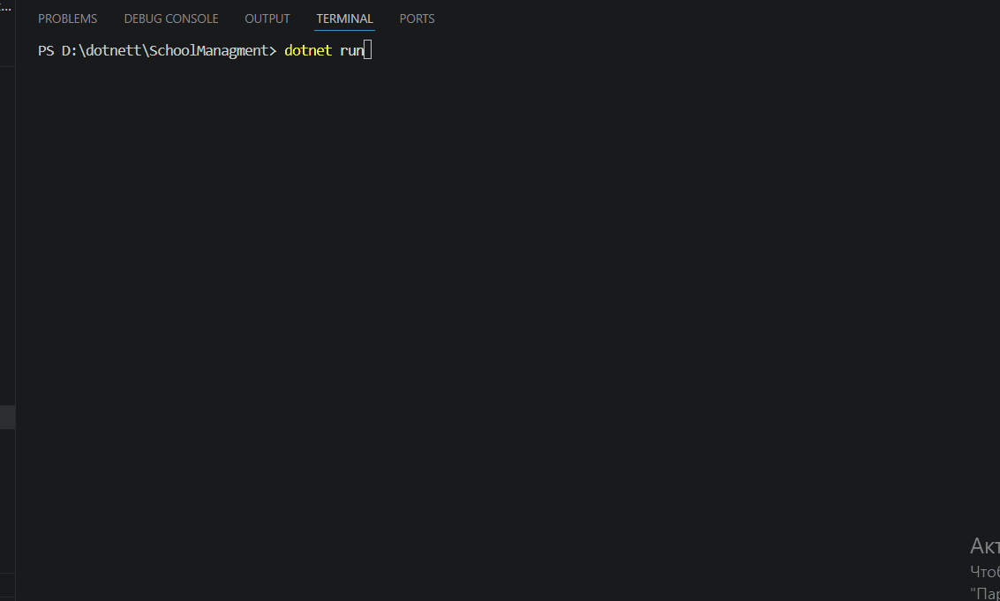

# School Management System

Simple Console App for managing Teachers and Students using C#.

## Features

### Teacher
- Add Teacher
- Show Teachers
- Update / Delete (basic CRUD)
- Delete Teacher
- Search Teacher by Name

### Student
- Add Student
- Show Students
- Update / Delete (basic CRUD)
- Delete Student
- Search Student by Name
- Show Student Count By Class

## Tech
- C#
- .NET Console
- OOP
- Dictionary<TKey, TValue>
- Interface

## Structure

## Project Structure

```text
SchoolManagement
│
├── Models
│   ├── Student.cs
│   └── Teacher.cs
│
├── Services
│   ├── StudentService
│   │   ├── IStudentService.cs
│   │   └── StudentService.cs
│   │
│   └── TeacherService
│       ├── ITeacherService.cs
│       └── TeacherService.cs
│
└── Program.cs
```

## Run



## Author
Tursunboy Ergashev